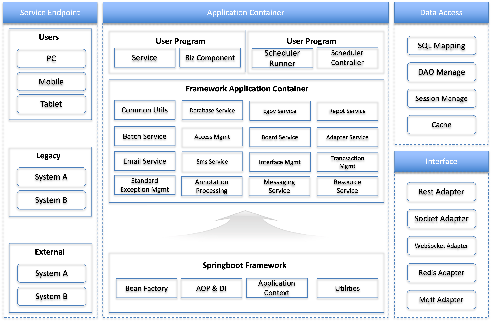

# Mobi Framwwork 사용 가이드

## 프로젝트 개요
이 가이드는 (주)모비에서 사용하기위한 프레임웍의 라이브러리를 관리하기 위해 만든 프로젝트이며, <br>
공통 프레임웍팀에서 제공되는 API를 기반으로 사용할 수 있도록 가이드하고 표준화하는데 사용됩니다. <br><br>
**FrameWork Archtecture 구성**<br>

**1. 기본(내부) 구성**<br>

   - springboot(3.4.5)
   - java(1.8)
   
   ex)설정 참조(e-mobi > pom.xml)
   ```xml
   <parent>
		<groupId>org.springframework.boot</groupId>
		<artifactId>spring-boot-starter-parent</artifactId>
		<version>3.5.4</version>
	</parent>
	<groupId>com.emobi</groupId>
	<artifactId>e-mobi</artifactId>
	<version>0.0.1</version>
	<packaging>pom</packaging>
	<name>mobi framework parent</name>
	<description>mobi framework parent</description>
	<distributionManagement>
		<repository>
			<id>github</id>
			<url>https://maven.pkg.github.com/cybercorea1004/mobi</url>
		</repository>
	</distributionManagement>
	<dependencies>
		<dependency>
			<groupId>org.projectlombok</groupId>
			<artifactId>lombok</artifactId>
			<scope>compile</scope>
		</dependency>
	</dependencies>
   ```
**2. 제공 component module**<br>

- com.emobi.emobi-common
(common util) : 공통으로 사용되는 util 및 interface 구성 <br>

- com.emobi.emobi-egov
(egovment framework application) : 전자 정부 프레임웍 컴포넌트 활용 구성<br>

- com.emobi.emobi-mqtt
(emobi mqtt) : 동기 토픽 교환을 통한 인터페이스 레파지토리 활용 <br>

- com.emobi.emobi-redis
(emobi-redis) : 비동기 토픽 교환을 통한 인터페이스 레파지토리 활용<br>

- com.emobi.emobi-socket
(socket) : 인터페이스 소켓 통신<br>

- com.emobi.emobi-rest
(emobi-rest) : Rest 통신<br>

- com.emobi.emobi-websocket
(emobi-websocket) : Websocket 통신<br>

- com.emobi.emobi-scheduler
(emobi-scheduler) : 다이나믹 스케쥴러를 통해 스케줄러의 생성 및 시작 / 정지 등을 관리한다. <br>

- com.emobi.emobi-nettyserver
(emobi netty server) : 비동기 인터페이스 서비스를 위한 Netty Server<br>

- com.emobi.emobi-mongo
(emobi-mongo) : MongoDB 데이터베이스<br>

- com.emobi.emobi-board
(emobi board) : 게시판 관리<br>

- com.emobi.emobi-ems-service : EMS 서비스 비지니스 예제<br>

- com.emobi.emobi-ems-mgmt
(emobi-ems-mgmt) : 관리자 서비스<br>

- com.emobi.emobi-ems-user
(emobi-ems-user) : 사용자 서비스<br>

- com.emobi.emobi-ems-example
(emobi-ems-example) : 사용자 서비스 예제<br>

- com.emobi.emobi-report
(emobi-report) : 보고서 관리<br>


- com.emobi.emobi-menu
(emobi menu) : 메뉴 관리<br>

- com.emobi.emobi-member
(emobi member) : 사용자 관리<br>

- com.emobi.emobi-auth
(emobi auth) : 사용자 로그인 <br>

- com.emobi.emobi-email
(emobi email) : 이메일 발송 관리<br>

- com.emobi.emobi-sms
(emobi sms) : SMS 발송 관리<br><br><br>
**3. 사용 방법**<br>

   - component scan
     ```xml
     @ComponentScan(basePackages = {"com.emobi"})
     ```
   가. emobi-common(공통모듈)
     - repository
  	 ```repository
     <repository>
		<id>github</id><!-- 아무거나 적당히 -->
		<url>https://maven.pkg.github.com/cybercorea1004/mobi</url>
	 </repository>
     ```
     - yml 설정
     ```yml
	logging:
	  config: classpath:logback-spring.xml
	management:
	  endpoints:
	    web:
	      exposure:
	        include: loggers  # loggers 엔드포인트 공개

	---
	spring:
	  config:
	    activate:
	      on-profile: local
	  main:
	    banner-mode: off
        data:
      mongodb:
        uri: mongodb://{user_name}:{user_pass}@{mongodb_ip}:{mongodb_port}/{database_name}
    server:
  		port: {server_port}
    ---
	spring:
	  config:
	    activate:
	      on-profile: dev
	  main:
	  	banner-mode: off
      mongodb:
        uri: mongodb://{user_name}:{user_pass}@{mongodb_ip}:{mongodb_port}/{database_name}
    server:
  		port: {server_port}
    ---
	spring:
	  config:
	    activate:
	      on-profile: prod
	  main:
	    banner-mode: off
      mongodb:
        uri: mongodb://{user_name}:{user_pass}@{mongodb_ip}:{mongodb_port}/{database_name}
    server:
  		port: {server_port}
    ```
    - slf4j(logback-spring.xml)
    ```slf4j
	<configuration scan="true" scanPeriod="30 seconds">
		<springProperty scope="context" name="springAppName"
			source="spring.application.name" defaultValue="logdemo" />
	
		<!-- 콘솔 공통 패턴 -->
		<property name="CONSOLE_PATTERN"
			value="[%d{yyyy-MM-dd HH:mm:ss}] [%thread] %-5level %logger{36} - %msg%n" />
	
		<!-- 환경별 분기 -->
		<springProfile name="local">
			<include resource="logback-local.xml" />
		</springProfile>
		<springProfile name="dev">
			<include resource="logback-dev.xml" />
		</springProfile>
	
		<springProfile name="prod">
			<include resource="logback-prod.xml" />
		</springProfile>
    </configuration>
    ```
    - logback-local.xml(예제)
    ```logback-local
	<configuration>
	    <appender name="CONSOLE" class="ch.qos.logback.core.ConsoleAppender">
	        <encoder>
	            <pattern>${CONSOLE_PATTERN}</pattern>
	        </encoder>
	    </appender>
	
	<!-- 패키지별 로그 레벨 설정 -->
	    <logger name="com.emobi" level="DEBUG" />
	    <logger name="org.springframework" level="INFO" />
	    
	    <root level="WARN">
	        <appender-ref ref="CONSOLE"/>
	    </root>
    </configuration>
    ```
	- dependency
    ```dependency
	<dependency>
		<groupId>com.emobi</groupId>
		<artifactId>emobi-common</artifactId>
		<version>0.0.1{-SNAPSHOT}</version> <!-- 필요 버전으로 변경 : 현재 개발 버전 -->
	</dependency>
     ```
   나. emobi-scheduler(다이나믹 스케쥴러 관리)
     - dependency
     ```xml
	<dependency>
		<groupId>com.emobi</groupId>
		<artifactId>emobi-scheduler</artifactId>
		<version>0.0.1{-SNAPSHOT}</version> <!-- 필요 버전으로 변경 : 현재 개발 버전 -->
	</dependency>
     ```
     - 시작시 Annotation
       ```
       @EnableScheduling
       ```
       : web 실행시 자동 실행됨
     - Controller 예제
    ```java
	package com.emobi.ems;

	import java.util.List;
	
	import org.springframework.http.ResponseEntity;
	import org.springframework.web.bind.annotation.PathVariable;
	import org.springframework.web.bind.annotation.PostMapping;
	import org.springframework.web.bind.annotation.RequestBody;
	import org.springframework.web.bind.annotation.RequestMapping;
	import org.springframework.web.bind.annotation.RestController;
	
	import com.emobi.common.vo.ScheduledTask;
	import com.emobi.scheduler.repository.ScheduledTaskRepository;
	import com.emobi.scheduler.service.DynamicSchedulerService;
	
	import lombok.RequiredArgsConstructor;
	
	@RequiredArgsConstructor
	@RestController
	@RequestMapping("/api/scheduler")
	public class SchedulerController {
	
	    private final ScheduledTaskRepository taskRepository;
	    private final DynamicSchedulerService schedulerService;
	
	    @PostMapping("/add")
	    public ResponseEntity<String> addTask(@RequestBody ScheduledTask task) {
	        taskRepository.save(task);
	        schedulerService.scheduleTask(task);
	        return ResponseEntity.ok("Task scheduled: " + task.getJobName());
	    }
	
	    @PostMapping("/cancel/{id}")
	    public ResponseEntity<String> cancel(@PathVariable String id) {
	        schedulerService.cancelTask(id);
	        return ResponseEntity.ok("Task canceled : " + id);
	    }
	    
	    @PostMapping("/delete/{id}")
	    public ResponseEntity<String> delete(@PathVariable String id) {
	        schedulerService.deleteTask(id);
	        return ResponseEntity.ok("Task delete : " + id);
	    }
	    
	    @PostMapping("/start/{id}")
	    public ResponseEntity<String> start(@PathVariable String id) {
	        schedulerService.startScheduleTask(id);
	        return ResponseEntity.ok("Task start : " + id);
	    }
	    @PostMapping("/list")
	    public List<ScheduledTask> list() {
	    	
	        return taskRepository.findAll();
	    }
	}
	

	```
    - scheduler 생성시 body(json) 예제
    ```body
    {
	    "id" : "a05",
	    "jobName" : "shin4",
	    "cron" : "*/10 * * * * ?",
	    "enabled" : true,
	    "className" : "runTestService",
	    "methodName" : "print"
	}
    ```
    다. emobi-member(사용자 관리)
     - dependency
     ```xml
	<dependency>
		<groupId>com.emobi</groupId>
		<artifactId>emobi-member</artifactId>
		<version>0.0.1{-SNAPSHOT}</version> <!-- 필요 버전으로 변경 : 현재 개발 버전 -->
	</dependency>
     ```
     - Controller 예제
    ```java

	package com.emobi.ems;
	
	import java.util.List;
	import java.util.Set;
	
	import org.springframework.http.ResponseEntity;
	import org.springframework.security.crypto.password.PasswordEncoder;
	import org.springframework.web.bind.annotation.PathVariable;
	import org.springframework.web.bind.annotation.PostMapping;
	import org.springframework.web.bind.annotation.RequestBody;
	import org.springframework.web.bind.annotation.RequestMapping;
	import org.springframework.web.bind.annotation.RestController;
	
	import com.emobi.common.vo.User;
	import com.emobi.user.member.service.UserService;
	
	import lombok.RequiredArgsConstructor;
	

	@RequiredArgsConstructor
	@RestController
	@RequestMapping("/api/auth/users")
	public class UserController {
	
	    private final UserService userService;
	    private final PasswordEncoder passwordEncoder;
	    
	
	    // 회원 생성
	    @PostMapping("/create")
	    public ResponseEntity<String> createUser(@RequestBody User user) {
	    	if(userService.getUserByName(user.getUsername()).isPresent()) {
	    		return ResponseEntity.badRequest().body("Username is already taken");
	    	}
	    	
	    	// 권한 기본값 설정
	        user.setPassword(passwordEncoder.encode(user.getPassword()));
	        User created = userService.createUser(user);
	        return ResponseEntity.ok("User registered successfully");
	    }
	
	    // 전체 조회
	    @PostMapping("/list")
	    public ResponseEntity<List<User>> getAllUsers() {
	        return ResponseEntity.ok(userService.getAllUsers());
	    }
	
	    // ID로 조회
	    @PostMapping("/user/{id}")
	    public ResponseEntity<User> getUserById(@PathVariable String id) {
	        return userService.getUserById(id)
	                .map(ResponseEntity::ok)
	                .orElse(ResponseEntity.notFound().build()); 
	    }
	
	    // 수정
	    @PostMapping("/update/{id}")
	    public ResponseEntity<User> updateUser(@PathVariable String id, @RequestBody User user) {
	        return userService.updateUser(id, user)
	                .map(ResponseEntity::ok)
	                .orElse(ResponseEntity.notFound().build());
	    }
	
	    // 삭제
	    @PostMapping("/delete/{id}")
	    public ResponseEntity<Void> deleteUser(@PathVariable String id) {
	        userService.deleteUser(id);
	        return ResponseEntity.noContent().build();
	    }
	}
	```
	- 사용자 생성시 body(json) 예제
    ```body
    {
	    "username": "shin5",
	    "email": "sunrise@emobi.kr",
	    "password": "12345",
	    "roles": ["USER"]
	}
    ```
    라. emobi-auth(로그인 관리)
     - dependency
     ```xml
	<dependency>
		<groupId>com.emobi</groupId>
		<artifactId>emobi-auth</artifactId>
		<version>0.0.1{-SNAPSHOT}</version> <!-- 필요 버전으로 변경 : 현재 개발 버전 -->
	</dependency>
     ```
     - Controller 예제
    ```java

	package com.emobi.ems;
	
	
	import java.util.List;
	import java.util.stream.Collectors;
	
	import org.springframework.http.ResponseEntity;
	import org.springframework.security.authentication.AuthenticationManager;
	import org.springframework.security.authentication.UsernamePasswordAuthenticationToken;
	import org.springframework.web.bind.annotation.PostMapping;
	import org.springframework.web.bind.annotation.RequestBody;
	import org.springframework.web.bind.annotation.RequestMapping;
	import org.springframework.web.bind.annotation.RestController;
	
	import com.emobi.common.vo.Menu;
	import com.emobi.user.member.dto.AuthRequest;
	import com.emobi.user.member.dto.AuthResponse;
	import com.emobi.user.menu.service.MenuService;
	import com.emobi.user.security.service.CustomUserDetailsService;
	import com.emobi.user.security.util.JwtUtil;
	
	import lombok.RequiredArgsConstructor;

	@RequiredArgsConstructor
	@RestController
	@RequestMapping("/api/auth")
	public class AuthController {
	
	    private final AuthenticationManager authManager;
	    private final JwtUtil jwtUtil;
	    private final CustomUserDetailsService userDetailsService;
	    private final MenuService menuService;
	
	
	    @PostMapping("/login")
	    public ResponseEntity<?> login(@RequestBody AuthRequest req) {
	        authManager.authenticate(
	                new UsernamePasswordAuthenticationToken(req.getUsername(), req.getPassword())
	        );
	        var userDetails = userDetailsService.loadUserByUsername(req.getUsername());
	       
	        List<String> roles = userDetails.getAuthorities().stream()
	                .map(a -> a.getAuthority())
	                .collect(Collectors.toList());
	        
	        List<String> menuIds = userDetails.getMenus();
	        System.out.println(menuIds.size());
	        List<Menu> menus = menuService.getMenuTree(menuIds); 
	        String token = jwtUtil.generateAccessToken(userDetails.getUsername(), roles, menus);
	        return ResponseEntity.ok(new AuthResponse(token, menus));
	    }
	}
	```
	- 로그인 시 response(json) 예제
    ```res
	{
	    "token": "eyJhbGciOiJIUzUxMiJ9.eyJzdWIiOiJzaGluMyIsInJvbGVzIjpbIlJPTEVfVVNFUiJdLCJtZW51cyI6W3siaWQiOiI3ZTViYTYwMTZlMjQ0NWJlYWU3YWY4OTYxYWIwZGIzYSIsIm5hbWUiOiJIb21lIiwicGF0aCI6Ii9ob21lIiwicGFyZW50SWQiOm51bGwsIm9yZGVyIjoxLCJjaGlsZHJlbiI6W119LHsiaWQiOiJhM2UxNmJhYjVlOGE0ZTY4OGMxYjk0MDExMTM4ZTQxNyIsIm5hbWUiOiJEYXNoYm9hcmQiLCJwYXRoIjoiL2Rhc2hib2FyZCIsInBhcmVudElkIjpudWxsLCJvcmRlciI6MiwiY2hpbGRyZW4iOltdfSx7ImlkIjoiYWUzMzRhMTFhN2ZhNDcxOGIwMWQxYmI3M2IwZWQ4NzUiLCJuYW1lIjoiU2V0dGluZ3MiLCJwYXRoIjoiL3NldHRpbmdzIiwicGFyZW50SWQiOm51bGwsIm9yZGVyIjozLCJjaGlsZHJlbiI6W3siaWQiOiJkOThjYWE2YjIyOWY0ZmNjYWFkNWI1ZjkwZTUxMDYzNSIsIm5hbWUiOiJVc2VyIE1hbmFnZW1lbnQiLCJwYXRoIjoiL3VzZXJzIiwicGFyZW50SWQiOiJhZTMzNGExMWE3ZmE0NzE4YjAxZDFiYjczYjBlZDg3NSIsIm9yZGVyIjoxLCJjaGlsZHJlbiI6W119XX1dLCJpYXQiOjE3NTU2NDc0NTYsImV4cCI6MTc1NTY1MTA1Nn0.59J-AcR65lVnEifmawQhYiQ5aArm7bG-IxL-81chJyxW113hYm5MsoavIqTdIu-EeamlMUAhENvH3pKKTggLpw",
	    "menus": [
	        {
	            "id": "7e5ba6016e2445beae7af8961ab0db3a",
	            "name": "Home",
	            "path": "/home",
	            "parentId": null,
	            "order": 1,
	            "children": []
	        },
	        {
	            "id": "a3e16bab5e8a4e688c1b94011138e417",
	            "name": "Dashboard",
	            "path": "/dashboard",
	            "parentId": null,
	            "order": 2,
	            "children": []
	        },
	        {
	            "id": "ae334a11a7fa4718b01d1bb73b0ed875",
	            "name": "Settings",
	            "path": "/settings",
	            "parentId": null,
	            "order": 3,
	            "children": [
	                {
	                    "id": "d98caa6b229f4fccaad5b5f90e510635",
	                    "name": "User Management",
	                    "path": "/users",
	                    "parentId": "ae334a11a7fa4718b01d1bb73b0ed875",
	                    "order": 1,
	                    "children": []
	                }
	            ]
	        }
	    ]
	}
    ```
  마. emobi-menu(메뉴 관리)
	 - dependency
	 ```xml
	<dependency>
		<groupId>com.emobi</groupId>
		<artifactId>emobi-menu</artifactId>
		<version>0.0.1{-SNAPSHOT}</version> <!-- 필요 버전으로 변경 : 현재 개발 버전 -->
	</dependency>
	 ```
	 - Controller 예제
	```java

	package com.emobi.ems;


	import java.util.List;
	
	import org.springframework.web.bind.annotation.PathVariable;
	import org.springframework.web.bind.annotation.PostMapping;
	import org.springframework.web.bind.annotation.RequestBody;
	import org.springframework.web.bind.annotation.RequestMapping;
	import org.springframework.web.bind.annotation.RestController;
	
	import com.emobi.common.vo.Menu;
	import com.emobi.user.menu.service.MenuService;
	
	import lombok.RequiredArgsConstructor;
	
	
	@RequiredArgsConstructor
	@RestController
	@RequestMapping("/menus")
	public class MenuController {
	
	 
	    private final MenuService menuService;
	
	    @PostMapping("/create")
	    public Menu createMenu(@RequestBody Menu menu) {
	        return menuService.createMenu(menu);
	    }
	
	    @PostMapping("/get/{id}")
	    public Menu getMenu(@PathVariable String id) {
	        return menuService.getMenu(id).orElseThrow(() -> new RuntimeException("Menu not found"));
	    }
	
	    @PostMapping("/plist/{parentId}")
	    public List<Menu> getMenusByParentId(@PathVariable String parentId) {
	        return menuService.getMenusByParentId(parentId);
	    }
	
	    @PostMapping("/all")
	    public List<Menu> getAllMenus() {
	        return menuService.getAllMenus();
	    }
	
	    @PostMapping("/update/{id}")
	    public Menu updateMenu(@PathVariable String id, @RequestBody Menu menu) {
	        return menuService.updateMenu(id, menu);
	    }
	
	    @PostMapping("/delete/{id}")
	    public void deleteMenu(@PathVariable String id) {
	        menuService.deleteMenu(id);
	    }
	}
	```
	- 메뉴 생성시 body(json) 예제
    ```body
	{
	    "name":"test2",
	    "path":"/test2",
	    "order":"1",
	    "parentId":"a0513cfe293849a9a5f54775df51f271" //루트 메뉴일 경우 생략
	}
    ```
